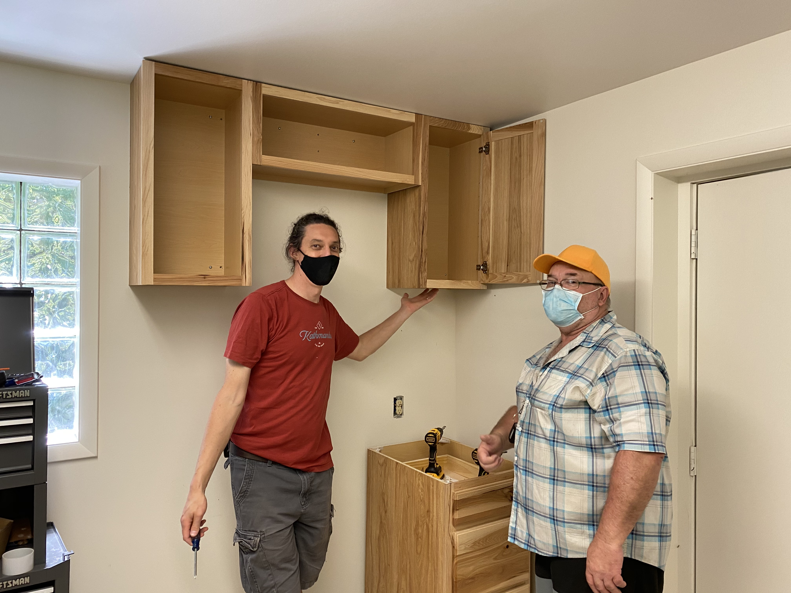
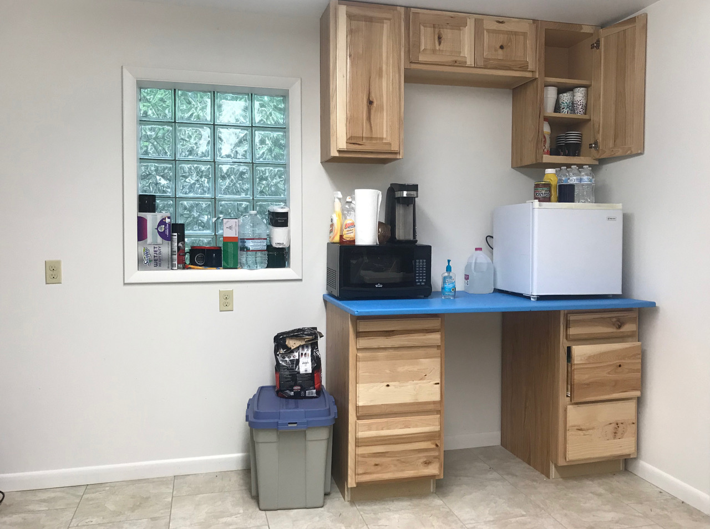
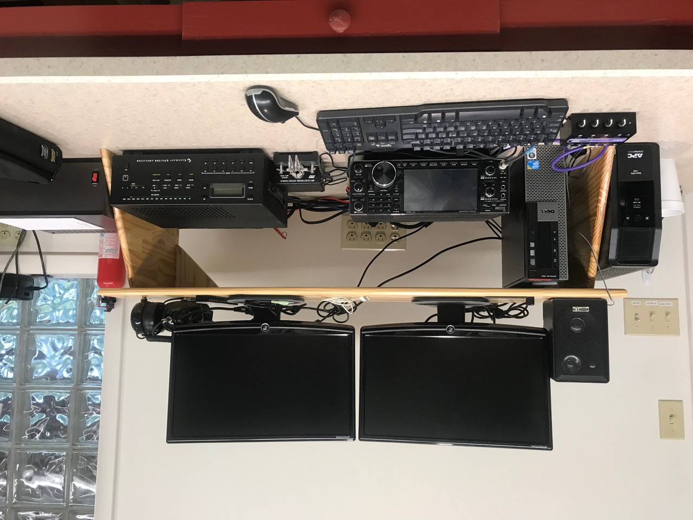
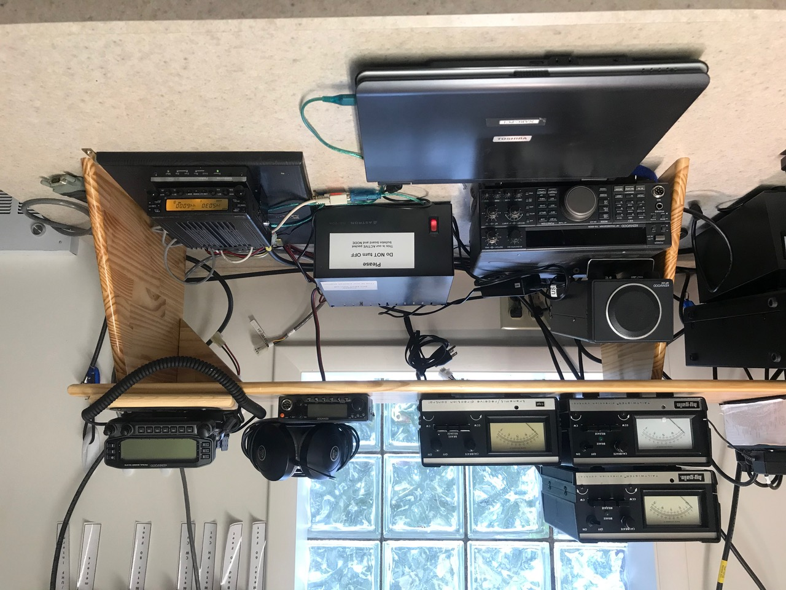

```{r setup, include=FALSE}
knitr::opts_chunk$set(echo = FALSE)
```

## Recent activities

- Work day (NK8Q, KC3FDD, N3LI, K3ROG) 
  - removed Yagi from precarious position for disassembly
  - installed cabinets on wall
- N3LI installed countertop
- N3LI installed IC-9100; updated digital software on IC-7610 & K3S
- K0LO, N3LI, W3EDP, & K3ROG met about secure network project

## Equipment status

```{r yagi-tilting, fig.align='center', out.height='500px'}
knitr::include_graphics("img/yagi-tilting.jpeg")
```

---

```{r, fig.align='center', out.width='700px'}
knitr::include_graphics("img/yagi-down.jpg")
```

---

```{r, fig.align='center', out.width='700px'}
knitr::include_graphics("img/yagi-safe.jpg")
```

---

```{r, fig.align='center', out.width='700px'}

```

---

```{r, fig.align='center', out.height='550px'}
knitr::include_graphics("img/cabinets-waiting-countertop.jpg")
```

---

```{r, fig.align='center', out.height='550px'}

```

## NARC 1 (Icom IC-7610)

```{r, fig.align='center', out.height='500px', fig.cap='Photo: Mike Coslo'}

```

## NARC 2 (Elecraft K3S)

```{r, fig.align='center', out.height='500px', fig.cap='Photo: Mike Coslo'}
knitr::include_graphics("img/narc-2.jpeg")
```

## NARC 3 (Icom 9100)

```{r, fig.align='center', out.height='500px', fig.cap='Photo: Mike Coslo'}
knitr::include_graphics("img/narc-3.jpeg")
```

## NARC packet

```{r, fig.align='center', out.height='500px', fig.cap='Photo: Mike Coslo'}

```

---

```{r, fig.align='center', out.height='350px', fig.cap='Photo: Mike Coslo'}
knitr::include_graphics("img/clubhouse-panorama.jpeg")
```

## Future work

- ~~Finish cabinet installation~~
- Install & test private network appliance with help from Mark K0LO
- Peform antenna maintenance prior to contest season
    - Repair 40m dipole (West 60' Tower)
- Repair and reinstall multi-band Yagi on North 80'

## Under consideration

- Research rotators & controller replacements
- Replace keyed lock with keyless
- Run 2nd coax lines to NARC-1 and NARC-2 to take advantage of dual receivers in both rigs
- Digital-only station (IC-9100?)
- Replace PCs and monitors

## Future clubhouse use

- October 3 • ARRL Simulated Emergency Test (SET)
- November 7-9 • ARRL Sweepstakes CW
- November 21-23 • ARRL Sweepstakes SSB
- November 28-29 • CQ WW DX CW
- December 4-6  • ARRL 160m

## Questions?
