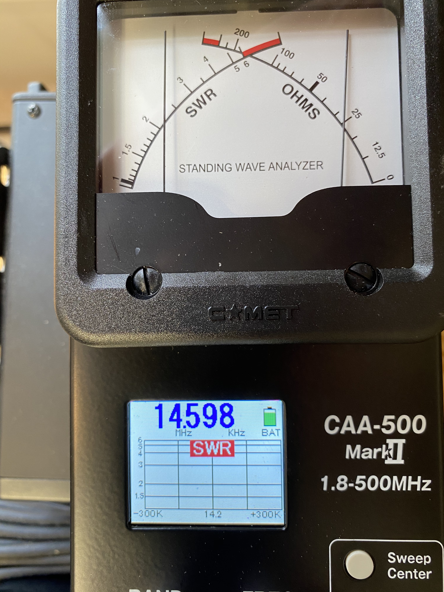
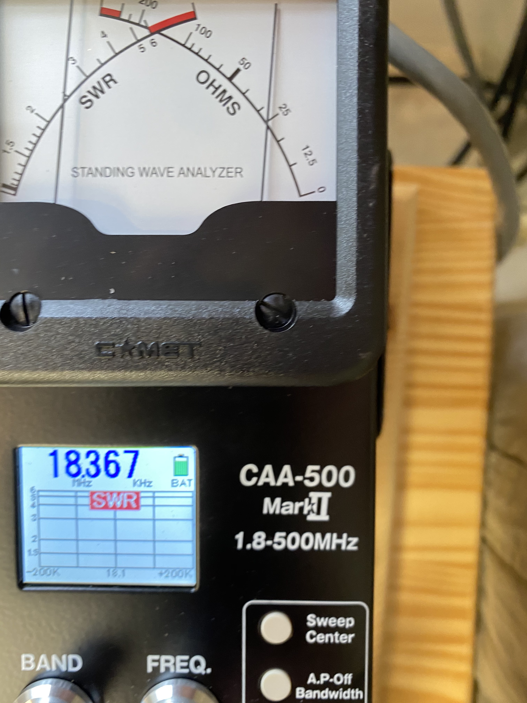
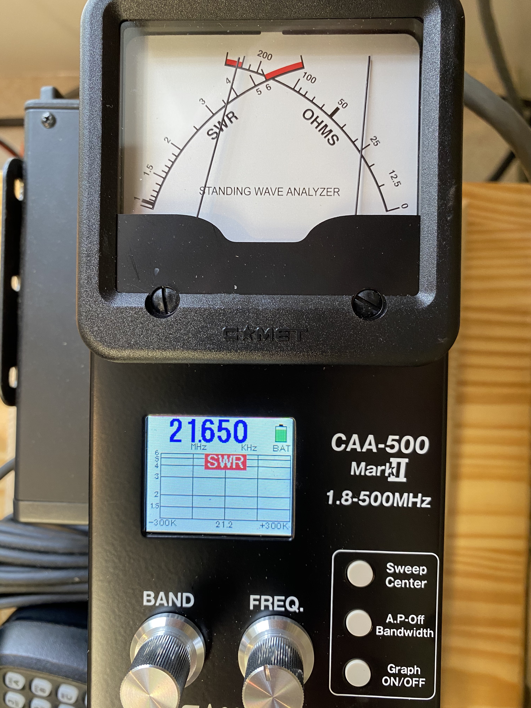
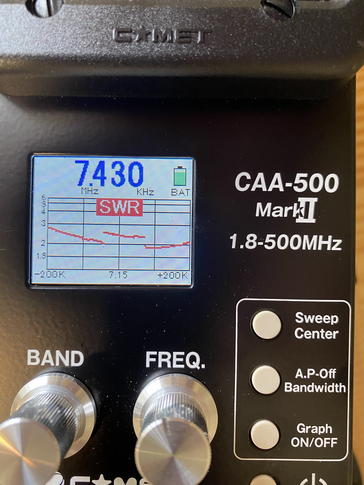
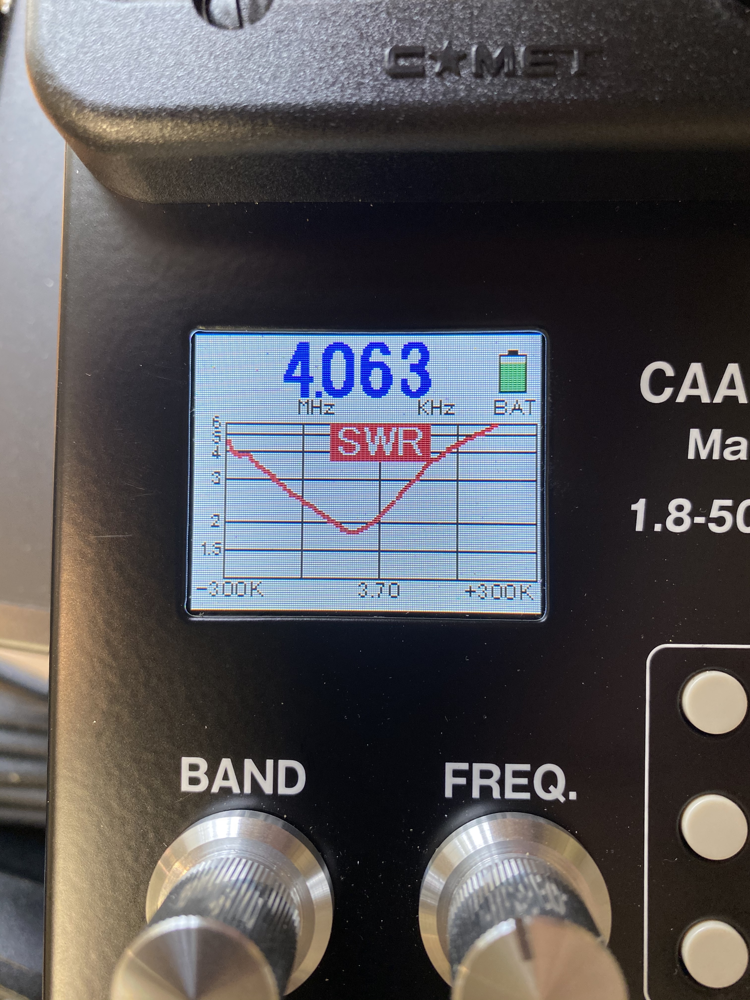
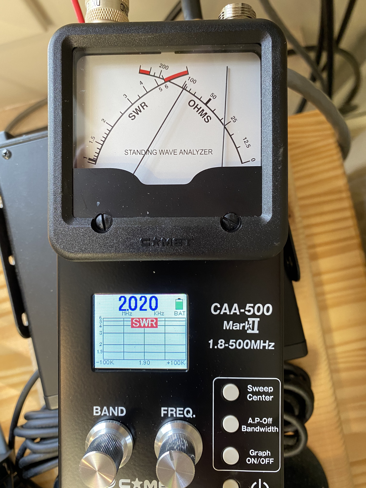
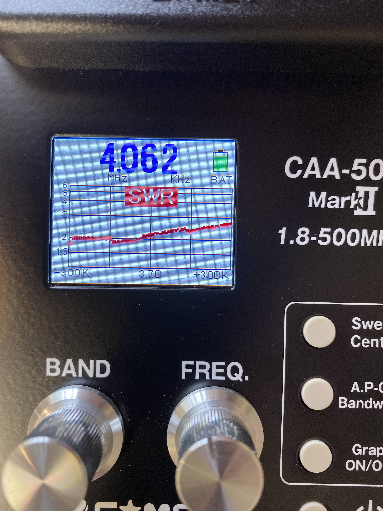

```{r setup, include=TRUE, echo=FALSE}
knitr::opts_chunk$set(echo = FALSE)
```

# Purpose

This report provides information about the tuning of the NARC mountaintop station HF antennas as of 2020-09-26, measured by K3ROG using his personal Comet CAA-500 Mark II antenna analyzer.

# Summary

- The single multiband Yagi (on the 60' West tower) is no longer resonant on 20, 17, or 15m. K3ROG did not test the other bands, but there appears to be a serious problem with the feedline and/or connectors.
- The sole 40m dipole that is still operational has an unusual jump in the SWR in the middle of the band. It should be inspected.
- The 80m CW cut dipole has a narrow bandwidth, but seems acceptable.
- The 80m phone cut dipole seems unusually broadband and should be checked.
- The 160m dipole is no longer resonant on the band.

# Recommendations

- A work day should be scheduled soon to diagnose problems with the antennas and determine what repairs we can make on our own vs. those that require assistance.
- Given the request to use the mountaintop station for the ARRL Simulated Emergency Test (SET) on Saturday, October 3, 2020, it may be necessary to bring and erect temporary antennas for the exercise. K3ROG has, for example, a self-supporting 80m/40m fan dipole designed for NVIS propagation that could be used.
- The mountaintop management team (K3ROG, N3LI, W3EDP) should develop a regular antenna testing and reporting regime.
- NARC should purchase an antenna analyzer and store it in a secure place at the mountaintop station.

# Tower-by-tower

## 60' West Tower

### Antennas

```{r, fig.cap="60' West Tower"}
knitr::include_graphics("img/60-ft-tower-west.jpg")
```

- 4 element Mosely triband (10, 15, 20m + WARC) Yagi
- ~~40m dipole~~

### Yagi SWR

#### 20m

```{r, fig.cap='Mosely Yagi 20m SWR'}

```

#### 17m

```{r, fig.cap='Mosely Yagi 17m SWR'}

```

#### 15m

```{r, fig.cap='Mosely Yagi 15m SWR'}

```

## 80' Middle Tower

### Antennas

```{r, fig.cap="80' Middle Tower"}
knitr::include_graphics("img/80-ft-tower-middle.jpg")
```

- VHF 4 element vertical orientation Yagi + rotator
- 2 VHF fixed direction vertical orientation 6 element Yagis (W3YA system)
- VHF vertical
- 40m dipole oriented NW/SE

### 40m dipole SWR

```{r, fig.cap='40m SWR'}

```

## 80' North Tower

### Antennas

```{r, fig.cap="80' North Tower"}
knitr::include_graphics("img/80-ft-tower-north.jpg")
```

- ~~4 element Mosely triband (10, 15, 20m + WARC) Yagi~~
  - Fell during late winter 2020; disassembled & awaiting order of new parts
- 160m dipole oriented NW/SE
- 80m dipole

### 80m dipole SWR

- I am not sure whether this tower hosts the 80m CW cut or the 80m phone cut
- Assuming CW cut

```{r, fig.cap='80m CW cut SWR'}

```

### 160m dipole SWR

```{r, fig.cap='160m SWR'}

```

## 60' East Tower

### Antennas

```{r, fig.cap="60' East Tower"}
knitr::include_graphics("img/60-ft-tower-east.jpg")
```

- VHF vertical
- 80m dipole oriented N/S

### 80m (phone?) SWR

```{r, fig.cap='80m phone SWR'}

```
