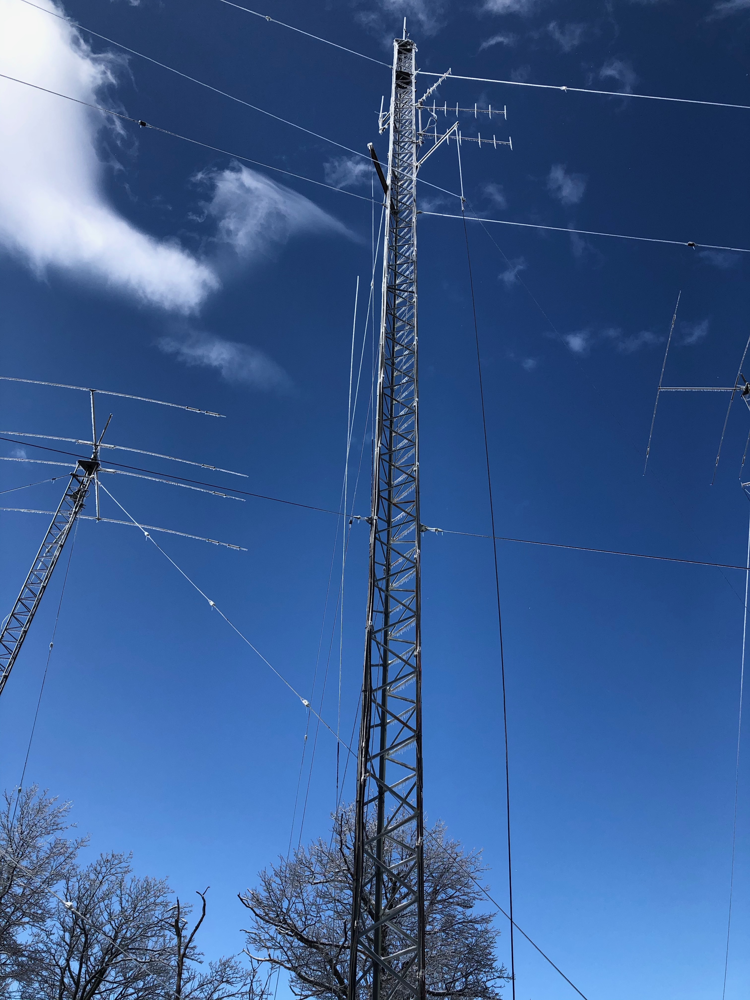
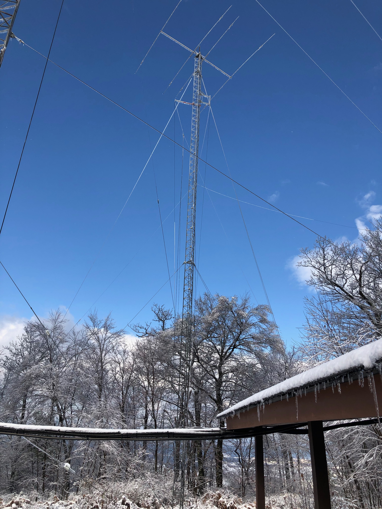
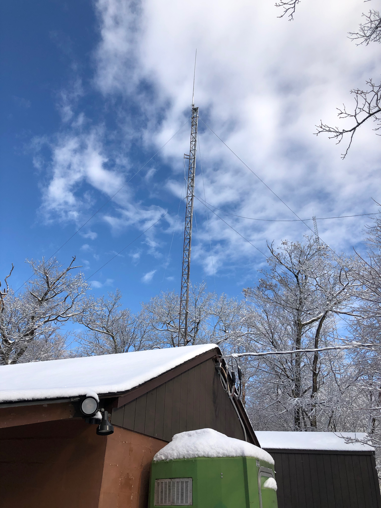
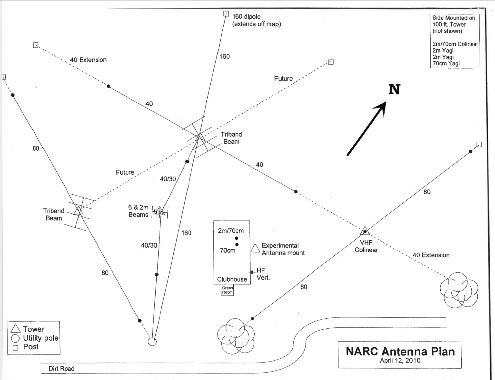

```{r setup, include=TRUE, echo=FALSE}
knitr::opts_chunk$set(echo = FALSE)
```

# Purpose

This report provides information about the tuning of the NARC mountaintop station HF antennas as of 2020-10-26.

# Summary

- The 160m dipole on the 80' North tower is no longer resonant on the band.
    - We suspect corrosion in a connector at the base of the tower.
- The 40m dipole on the 60' West Tower is down and needs to be put back up again.

# Recommendations

- A work day should be scheduled soon to diagnose problems with the antennas and determine what repairs we can make on our own vs. those that require assistance.
- The mountaintop management team (K3ROG, N3LI, W3EDP) should develop a regular antenna testing and reporting regime.

# Tower-by-tower

## 60' West Tower

### Antennas

```{r, fig.cap="60' West Tower"}
knitr::include_graphics("img/60-ft-tower-west.jpg")
```

- 4 element [Mosely CL-33-M-WARC](http://www.mosley-electronics.com/classic.html) tri-bander + WARC triband (10, 15, 20m + WARC) Yagi
- ~~40m dipole~~

## 80' Middle Tower

### Antennas

```{r, fig.cap="80' Middle Tower"}

```

- VHF 4 element vertical orientation Yagi + rotator
- 2 VHF fixed direction vertical orientation 6 element Yagis (W3YA system)
- VHF vertical
- 40m dipole oriented NW/SE

## 80' North Tower

### Antennas

```{r, fig.cap="80' North Tower"}

```

- ~~4 element [Mosely CL-33-M-WARC](http://www.mosley-electronics.com/classic.html) triband (10, 15, 20m + WARC) Yagi~~
  - Fell during late winter 2020
  - Disassembled
  - Need to identify and order new parts
- 160m dipole oriented NW/SE
- 80m dipole

## 60' East Tower

### Antennas

```{r, fig.cap="60' East Tower"}

```

- VHF vertical
- 80m dipole oriented N/S

# Antenna plan

We developed and implemented an antenna plan in 2010.

```{r, fig.cap="Antenna plan 2010-04-12"}

```
