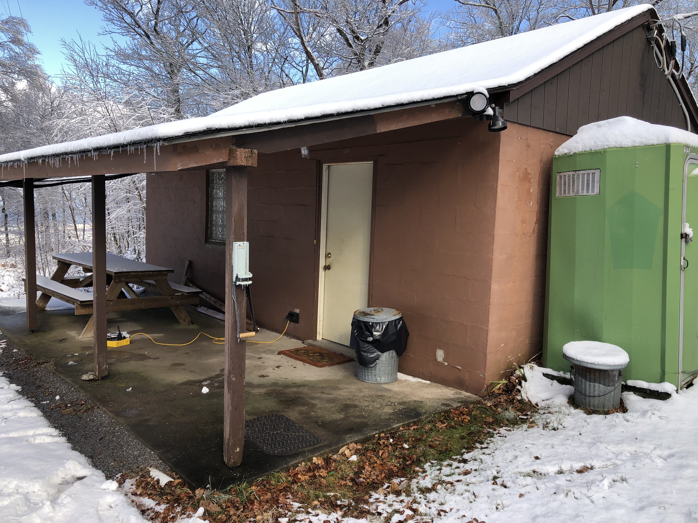

```{r, include=FALSE}
knitr::opts_chunk$set(echo = FALSE, warning = FALSE, 
                      message = FALSE,
                      fig.align = "center",
                      fig.width = 6.5,
                      out.width = "75%")
```

# Arrival procedures

- Unlock the gate. Use the small key to unlock the padlock. The larger key opens the clubhouse itself. Take the padlock with you to the shack.
- Close the gate and replace the lock bar, but do not re-lock the gate.
  - If you know that others will be joining you, you may leave the gate open, but make sure to park cross-wise, blocking the past the shack. This ensures that no other driver can inadvertently drive past you and get locked behind the gate when you leave.
  
```{r, fig.cap="NARC Clubhouse looking North"}

```
  
- Unlock door of the shack using the larger of the two keys. 
There is one lock above the door handle. 
Turn the key to the left (counterclockwise) to unlock the door.
- There are light switches on the left just inside the door.
- Put the padlock and locking bar on the desk near the door.
- Turn up the heat, if needed. 
  - Go to the breaker box near the southeast corner of the shack (on your right as you enter the shack). 
By default, we leave breakers 7-14 -- the baseboard and north wall 240 V heaters -- **off**, and the remainder on. There is a label on the breaker panel to remind you.
  - Turn breakers 7-14 **on** by pushing the breaker lever to the left to align with the others.
- The porta potty key is on a hook to the right of the door.
The porta potty is on the South side of the shack.
- Please text Rick K3ROG (814-777-3298), Eric W3EDP (814-867-3393), or Mike N3LI (814-404-3991) when you leave. 
Please report any issues that need to be addressed.

# Wifi & internet use

<!-- Icom IC-7610 -->
```{r wifi-internet, child = 'wifi-internet.Rmd'}
```

# Equipment setup

<!-- Icom IC-7610 -->
```{r ic-7610, child = 'IC-7610.Rmd'}
```

<!-- Elecraft K3S -->
```{r k3s, child = 'elecraft-k3s.Rmd'}
```

<!-- KPA1500 -->
```{r kpa1500, child = 'KPA1500.Rmd'}
```

<!-- KPA1500 tuning -->
```{r kpa1500-tuning, child = 'KPA1500-tuning.Rmd'}
```

<!-- IC-2710 Packet -->
```{r IC-2710, child = 'packet.Rmd'}
```

# Operating procedures

## Digital modes

### WSTJ-X

```{r wsjt-x-ic-7610, child='WSJT-X-IC-7610.Rmd'}
```

```{r wstj-x-k3s, child='WSJT-X-K3S.Rmd'}
```

### fldigi

```{r fldigi-ic-7610, child='fldigi-IC-7610.Rmd'}
```

```{r fldigi-k3s, child='fldigi-K3S.Rmd'}
```

### JS8Call

Installed; guide forthcoming.

## Phone

```{r, child='SSB-IC-7610.Rmd'}
```

## CW

## RTTY

# Departure procedures

- Power down all the equipment you used.
- Turn off the UPS.
    - For the NARC1/IC-7610 station, press and hold the UPS Power button until you hear a single beep.
    - For the NARC2/K3S station, press and hold the UPS Power button until you hear one long and two short beeps.
- Unplug the UPS from the wall sockets.
- Unplug the 220 V power amplifier power supplies from the wall sockets.
- Unplug the antenna rotator power supplies from the wall sockets.
- Turn breakers 7-14 -- the baseboard and north wall 240 V heaters -- **off**.
- Return the porta potty key to the desktop to the right side of the door.
- Take the padlock to the gate with you and the L-shaped latch if you did not leave it in the gate.
- As you leave the shack, close and lock the door by turning the key to the right (clockwise). 
Check again to confirm that the door is closed and locked.
- As you reach the gate, stop, remove the lock bar, and swing the gate out of the way.
- Drive through and stop just outside the gate.
- Swing the gate back into closed position. Place the lock bar in position, and lock the gate.
- Please text Rick K3ROG (814-777-3298), Eric W3EDP (814-867-3393), or Mike N3LI (814-404-3991,) when you leave. 
Please report any issues that need to be addressed.

```{r, child='antennas.Rmd'}
```
