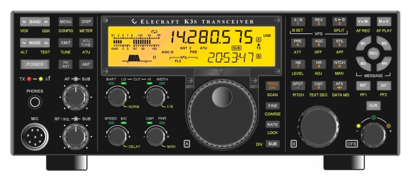

```{r, include=FALSE}
knitr::opts_chunk$set(echo = FALSE, warning = FALSE, 
                      message = FALSE,
                      fig.align = "center",
                      out.width = "600px")
```

## Elecraft K3S

```{r}

```

### Equipment summary

- Elecraft K3S (HF + 6m) transceiver
  - Astron RS-35A power supply
- Elecraft KPA1500
  - Elecraft power supply
- Elecraft P3 Panadapter
- Footswitch on the floor.
- Heil Pro 7 headset.
- Bencher BY-1 paddle.
- Windows 10 PC, single monitor set-up, dual monitor capable
  - WSTJ-X, JS8Call, fldigi, N1MM, N3FJP

### Connect and power-up

- Connect the UPS to the wall power outlet.
    - The UPS is on the window sill behind the station. 
    The power cable has an orange tag.
- Press and hold the UPS POWER button until you hear 2 beeps.
- Connect the 240 V Elecraft KPA1500 power supply cable to the 240 V outlet.
The power cable has an orange tag.
- Power up the Astron RS-35A power supply by pressing the red 'on' switch on the lower left front part of the panel.
- Power up the K3S.
    - The POWER button is on the left side of the left side of the rig front panel.
- Power up the P3 Panadapter.
This step is mandatory!
- Power up the KPA1500 by pressing the 'ON' switch on the lower right panel.

```{r, fig.cap="KPA1500 Power Switch"}

```

