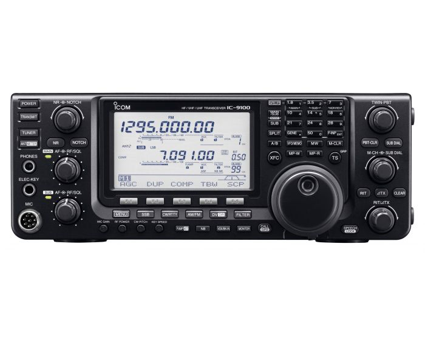

## Icom IC-9100

```{r}

```

The IC-9100 is currently connected to the NARC-3 computer.
NARC3 is located near the corner of the short desk on the North wall of the station.

### Equipment summary

### Connect and power-up

1. ~~Connect to the power mains~~.

This rig's power supply is not disconnected.

2. Connect the radio to a suitable antenna.

**Before you power up the radio, connect it to a suitable antenna**.
**The antenna connections are located on the north wall, near the repeater cabinet**.
Choose the PL-259 connector with the COLOR K3S tag.
Plug the cable from the radio into the cable connector for one of the antennas, for example, one of the triband Yagis for 10-20 m.
**Please do not remove the N/PL-259 connectors from the antenna feedlines.**
    
3. ~~Power up the UPS~~.

The UPS is typically powered up, so this step is unnecessary.

4. Power up the Astron RS-35A power supply. 

5. Power up the IC-9100

#### Log-in to the computer

1. Power up the NARC3 PC by pressing the power button on the front panel.

2. Log-in using the appropriate password.
