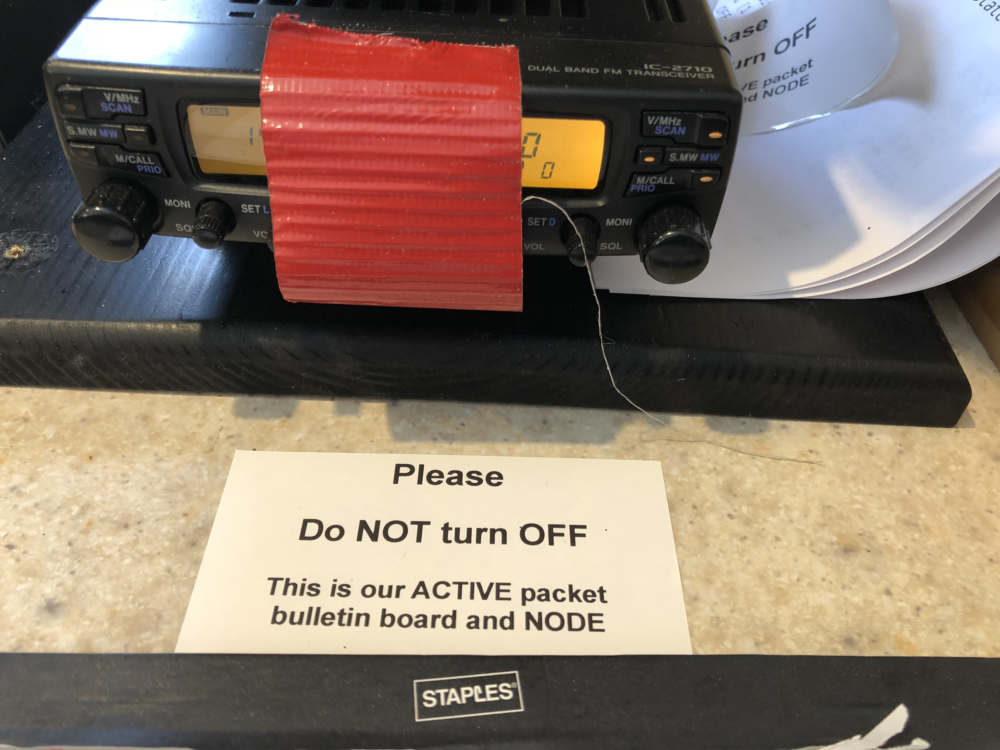

## Packet station

The packet station is located along the North wall of the shack near the HF antenna feedlines.

- Icom IC-2710 Dual Band Transceiver set to 145.030 MHz
- Laptop
- Astron power supply

```{r, fig.cap="IC-2710 Packet Transceiver"}

```
